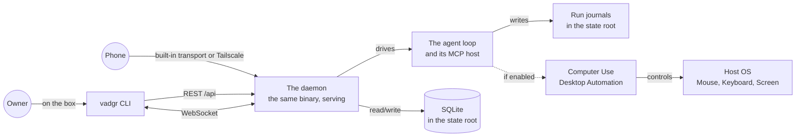

<p align="center">
  
  <picture>
    <source media="(prefers-color-scheme: dark)" srcset="docs/NameLigth.svg">
    <source media="(prefers-color-scheme: light)" srcset="docs/NameDark.svg">
    
  </picture>
</p>

<p align="center">
  
</p>


<p align="center">
  <i><b>An open-source loop that controls your computer, reachable from your phone.</b></i>
</p>

Describe your work in a sentence. Vadgr runs it on your machine - writing code, controlling apps, clicking buttons, and delivering results - while you do something else. You start it from this CLI or from the phone app, and watch it from either. It is not tied to one model vendor: the machine talks to whichever provider you point it at. Cross-platform: Linux, Windows, WSL2 and macOS.

## Platform

<div align="left">

|  | Technology | Status | Role |
|:---:|:---:|:---:|:---|
|  | Linux | Native | Graphical AppImage installer and local console on x86_64 and aarch64 |
|  | Windows | Native | Authenticode-signed setup and local console on x64 and arm64 |
|  | WSL2 | CLI-only | Signed-manifest `install.sh` lifecycle on x86_64 and aarch64 |
|  | macOS | Native | Notarized package, local console, and stable signed computer-use host on Intel and Apple Silicon |

</div>

## Install

Vadgr carries its pinned desktop-automation and Python runtime. An installed
machine needs no checkout, system Python, pip, uv, Rust, Git or Node.js.

- Windows uses the signed `Vadgr-0.5.0-windows-<arch>-setup.exe` wizard.
- macOS uses the signed and notarized `Vadgr-0.5.0-macos-<arch>.pkg` wizard.
- native Linux uses the graphical
  `Vadgr-0.5.0-linux-<arch>-installer.AppImage`.
- WSL remains GUI-free and uses the release's attested `install.sh` plus its
  architecture-specific archive.

Download the vehicle, signed release manifest, signature and published hashes
from the immutable v0.5.0 release. Verify them before launch. Every installer
shows the canonical terms before mutation and records explicit acceptance only
after a successful install. Declining or failed verification changes nothing.

Windows, macOS and native Linux install one small local console for machine
information and editing, device/transport status, pairing, provider setup,
daemon restart, update, repair, rollback and package-aware uninstall. Owner data
is preserved by default; deleting it is a separate typed destructive action.

The daemon owns OpenAI, Gemini and Anthropic connections, their authenticated
model catalogs and the machine default. It calls provider APIs directly and does
not use an agent CLI as a model runtime.

Restart your terminal, then:

```bash
vadgr start
```

### Vadgr CLI

**Services:**

| Command | Description |
|---------|-------------|
| `vadgr start` | Start the vadgr daemon (`vadgr api` is the same command) |
| `vadgr stop` | Stop the daemon |
| `vadgr restart` | Restart the daemon |
| `vadgr status` | Show whether the daemon is running |
| `vadgr logs` | Tail the daemon's log |
| `vadgr update` | Verify and launch the platform's signed package update |

**Runs:**

| Command | Description |
|---------|-------------|
| `vadgr run "<task>"` | Start a run from a task sentence and watch it |
| `vadgr run "<task>" --background` | Start it and return straight away |
| `vadgr run "<task>" -p <provider> -m <model>` | Run it on a named provider and model |
| `vadgr runs list [--status failed]` | List runs |
| `vadgr runs get <id>` | Show run details |
| `vadgr runs cancel <id>` | Cancel a running run |
| `vadgr runs resume <id>` | Resume a failed run |

`vadgr run` exits `0` when the run completed, `1` when it failed, `2` on a
usage error, `3` when the daemon is not reachable, and `130` on Ctrl-C, which
stops watching and leaves the run going.

**Info:**

| Command | Description |
|---------|-------------|
| `vadgr health` | Check the daemon's health |
| `vadgr providers` | List available providers and models |
| `vadgr computer-use enable` | Enable desktop automation |
| `vadgr computer-use disable` | Disable desktop automation |
| `vadgr computer-use status` | Show computer use and daemon status |

**Machine:**

| Command | Description |
|---------|-------------|
| `vadgr machine` | Show the machine identity and complete configuration |
| `vadgr config get <key>` | Read one editable machine setting |
| `vadgr config set name <name>` | Rename the local machine |
| `vadgr config set default_model <provider>/<model>` | Change the validated default model pair |

**Providers:**

| Command | Description |
|---------|-------------|
| `vadgr provider login [openai\|gemini\|anthropic]` | Connect or reauthenticate one provider |
| `vadgr provider status [--refresh] [provider]` | Show connections and authenticated catalogs |
| `vadgr provider logout <provider>` | Disconnect a provider that is not the default |
| `vadgr model list` | List models from every connected provider |
| `vadgr model default [provider/model]` | Live-test and set the machine default |

## Architecture



## Modules

### The CLI

`vadgr` starts runs, watches them, pairs the phone and manages the daemon. It
talks to the daemon over HTTP and to a run over a WebSocket, so it is a client
like any other, with no private path in.

### The daemon

One binary. It serves the API the phone and the CLI both call, runs the loop,
owns the MCP host and the cua connection, and writes an append-only journal per
run so a killed machine resumes rather than restarts. Its state lives below the
platform's local-state directory, never below the directory it was started from.

### Reaching it from the phone

The daemon serves every transport it supports and reports the list; the phone
picks between them at pairing, and a paired phone can switch to another one
later without pairing again. Today that list is two entries on every machine:

- **Built-in.** An [iroh](https://www.iroh.computer/) endpoint inside the
  binary. Nothing installs it and nothing switches it on. The machine's
  identity is a public key, a relay introduces the two ends, and most
  connections go direct after that. Traffic is end-to-end encrypted between
  the two endpoint keys; a relay forwards sealed packets it cannot read.
- **Tailscale.** The tailnet adapter, as before. Whether it works is
  discovered when it is used: if tailscaled is not running here, pairing says
  so in that transport's own words and the built-in transport carries the
  phone.

Run `vadgr pair` and scan the QR. The code is one-time and valid for five
minutes, and every route needs both an authorized peer and the device token.

Two settings exist, and neither is needed for normal use:

- `VADGR_IROH_RELAYS` points the built-in transport's rendezvous somewhere
  else: a comma-separated list of `https` relay URLs for self-hosted
  [iroh-relay](https://github.com/n0-computer/iroh) instances, or `none` for
  a directly reachable machine. Unset means n0's public relays, which are
  fine for development and testing; they see connection metadata (addresses,
  timing, volume), never payloads. `none` is deliberately not the default:
  it fails on exactly the networks strangers bring, and the app cannot tell
  "machine off" from "this NAT pair cannot meet".
- `VADGR_TRANSPORT=loopback` serves nothing off this machine. It is the mode
  tests and CI run in, it takes no other value, and removing it restores the
  default: the machine serves what it supports.

The endpoint's secret key lives at `credentials/iroh_secret_key` under the
state root, owner-only. Keep it: a new key is a new machine as far as every
paired phone is concerned.

### Desktop Automation

Vadgr installs its pinned desktop-automation MCP server inside its private
payload. It gives runs eyes and hands: take a screenshot, reason, click or type,
then repeat. Do not install Python or `vadgr-computer-use` separately. Linux
prints its system-package plan before changing anything. WSL and Windows need
no payload setup. macOS reports the grants its private interpreter needs.

## Structure

```text
Vadgr/
|-- Cargo.toml              # backend, CLI and native console crate
|-- src/
|   |-- cli/                # the `vadgr` command
|   |-- console/            # installed eframe machine console
|   |-- install/            # verified package lifecycle and receipts
|   |-- routes/             # HTTP endpoints
|   |-- engine/             # loop, journal, providers and MCP host
|   |-- auth/               # pairing and authorization gates
|   |-- db/                 # SQLite schema and repositories
|   `-- transport/          # loopback, built-in iroh and Tailscale
|-- packaging/              # native package sources and integrity policy
|-- tests/                  # unit and integration tests
|-- E2E/                    # public release runbooks
|-- install.sh              # WSL-only package lifecycle
`-- scripts/                # repository and release gates
```

Desktop automation ships as a released package from
[vadgr-computer-use](https://github.com/MONTBRAIN/vadgr-computer-use). Vadgr
pins and installs that package inside its own private payload.

## Contributing

1. Create a branch from `master`:
   ```bash
   git checkout master && git checkout -b feature/your-change
   ```
2. Make your changes and commit:
   ```bash
   git add . && git commit -m "your message"
   ```
3. Push and open a PR into `master`:
   ```bash
   git push -u origin feature/your-change
   ```
