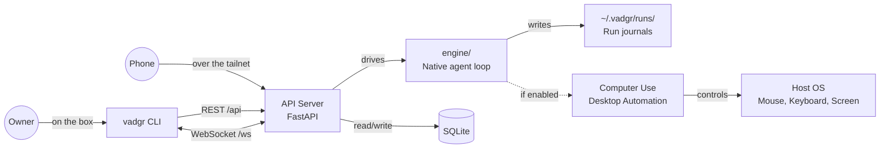

<p align="center">
  
  <picture>
    <source media="(prefers-color-scheme: dark)" srcset="docs/NameLigth.svg">
    <source media="(prefers-color-scheme: light)" srcset="docs/NameDark.svg">
    
  </picture>
</p>

<p align="center">
  
</p>


<p align="center">
  <i><b>An open-source loop that controls your computer, reachable from your phone.</b></i>
</p>

Describe your work in a sentence. Vadgr runs it on your machine - writing code, controlling apps, clicking buttons, and delivering results - while you do something else. You start it from this CLI or from the phone app, and watch it from either. It is not tied to one model vendor: the machine talks to whichever provider you point it at. Cross-platform: Linux, Windows (WSL2), and macOS (in progress).

## Platform

<div align="left">

|  | Technology | Status | Role |
|:---:|:---:|:---:|:---|
|  | Linux | Stable | Primary platform |
|  | Windows / WSL2 | Stable | Supported platform |
|  | macOS | WIP | Work in progress |

</div>

## Install

Works on **Linux**, **WSL**, and **Windows**. macOS support is in progress (running work locally works, computer use does not). The installer sets up everything: git, Python, dependencies, and the `vadgr` CLI. No Node.js and no browser: the machine's clients are this CLI and the phone app.

```bash
# Linux / macOS / WSL
curl -fsSL https://raw.githubusercontent.com/MONTBRAIN/vadgr/master/setup.sh | bash
```

```powershell
# Windows (PowerShell)
irm https://raw.githubusercontent.com/MONTBRAIN/vadgr/master/setup.ps1 | iex
```

The still-default Python daemon runs work through `providers.yaml` until the
`0.4.9` cutover. The side-by-side Rust daemon now owns additive OpenAI, Gemini
and Anthropic connections, authenticated model catalogs and its machine
default. It calls provider APIs directly and does not use an agent CLI as a
model runtime.

Restart your terminal, then:

```bash
vadgr start
```

### Vadgr CLI

**Services:**

| Command | Description |
|---------|-------------|
| `vadgr start` | Start the vadgr daemon (`vadgr api` is the same command) |
| `vadgr stop` | Stop the daemon |
| `vadgr restart` | Restart the daemon |
| `vadgr status` | Show whether the daemon is running |
| `vadgr logs` | Tail API server logs |
| `vadgr update` | Pull latest code and reinstall deps |

**Runs:**

| Command | Description |
|---------|-------------|
| `vadgr run "<task>"` | Start a run from a task sentence and watch it |
| `vadgr run "<task>" --background` | Start it and return straight away |
| `vadgr run "<task>" -p <provider> -m <model>` | Run it on a named provider and model |
| `vadgr runs list [--status failed]` | List runs |
| `vadgr runs get <id>` | Show run details |
| `vadgr runs cancel <id>` | Cancel a running run |
| `vadgr runs resume <id>` | Resume a failed run |

`vadgr run` exits `0` when the run completed, `1` when it failed, `2` on a
usage error, `3` when the daemon is not reachable, and `130` on Ctrl-C, which
stops watching and leaves the run going.

**Info:**

| Command | Description |
|---------|-------------|
| `vadgr health` | Check API health |
| `vadgr providers` | List available providers and models |
| `vadgr computer-use enable` | Enable desktop automation |
| `vadgr computer-use disable` | Disable desktop automation |
| `vadgr computer-use status` | Show computer use and daemon status |

**Providers on the side-by-side Rust daemon:**

| Command | Description |
|---------|-------------|
| `vadgr provider login [openai\|gemini\|anthropic]` | Connect or reauthenticate one provider |
| `vadgr provider status [--refresh] [provider]` | Show connections and authenticated catalogs |
| `vadgr provider logout <provider>` | Disconnect a provider that is not the default |
| `vadgr model list` | List models from every connected provider |
| `vadgr model default [provider/model]` | Live-test and set the machine default |

### Manual setup

If you prefer to set things up manually, see [api/README.md](api/README.md) and [cli/README.md](cli/README.md).

Provider parser families and real sample log lines are documented in [PROVIDER_PARSER_GUIDE.md](PROVIDER_PARSER_GUIDE.md).

## Architecture



## Modules

### The CLI

Starts runs, watches them, and manages the daemon. Talks to the API over HTTP and to the run stream over a WebSocket.

**Rewritten in Rust at `0.4.8`**, in [rust/](rust/), with every command keeping its name, its arguments and its exit codes. Like the Rust daemon beside it, the new CLI is built from the checkout for now: the installer still puts the Python [cli/](cli/) on your `PATH`, and the swap happens at the `0.4.9` cutover.

### [api/](api/) - REST API + run lifecycle

FastAPI backend: it takes a task, starts a run, drives the loop, and records the outcome. See [api/README.md](api/README.md).

### [engine/](engine/) - The native agent loop

The provider-agnostic loop that owns the conversation history, calls the model, dispatches tools, and journals every step to `~/.vadgr/runs/`.

### [rust/](rust/) - The daemon, being rewritten

The daemon is moving to Rust, and this crate runs **beside** the Python one on its own port and its own database until the cutover. **The `vadgr` CLI is already Rust, and lives here too.** `0.4.7` adds vadgr-owned provider onboarding, credentials, authenticated catalogs and direct OpenAI, Gemini and Anthropic adapters to the native loop, control plane, cua MCP host and durable recovery path. Until the cutover, the Python daemon is still the default product entry point. See [rust/README.md](rust/README.md).

### Desktop Automation

The desktop-automation MCP server lives in its own repository: **[vadgr-computer-use](https://github.com/MONTBRAIN/vadgr-computer-use)**. Install with `pip install vadgr-computer-use`. It gives agents eyes and hands: take a screenshot, reason, click or type, repeat. On WSL2 the package manages its own Windows-side bridge daemon automatically.

## Structure

```
Vadgr/
├── cli/                   # The Python CLI, still installed, leaving at 0.4.9
│   ├── main.py            # Root Click group and `vadgr run`
│   ├── client.py          # HTTP client for the API
│   ├── stream.py          # The run watcher
│   ├── commands/          # runs, info, pair, service
│   └── tests/             # Unit + integration tests
├── api/                   # REST API + run lifecycle
│   ├── main.py            # FastAPI app
│   ├── routes/            # HTTP endpoints and the two sockets
│   ├── services/          # Run lifecycle, computer-use setup
│   ├── engine/            # Provider selection and the native bridge
│   ├── auth/              # Pairing and the two gates
│   ├── transport/         # Loopback and Tailscale adapters
│   └── persistence/       # SQLite database
├── engine/                # The native agent loop and its journal
├── rust/                  # The CLI, and the daemon being rewritten in Rust (see rust/README.md)
├── E2E/                   # One runbook per release, and its evidence
# Desktop automation lives in:
# https://github.com/MONTBRAIN/vadgr-computer-use
# (installed via `pip install vadgr-computer-use` when enabled)
├── providers.yaml         # Provider configs and the machine default
└── data/                  # SQLite database (created at runtime)
```

## Technologies

**Backend**

<div align="left">

|  | Technology | Version | Role |
|:---:|:---:|:---:|:---|
|  | FastAPI | 0.115 | Web framework |
|  | Python | 3.12 | Runtime language |
|  | SQLite | 3 | Relational database |
|  | Pydantic | 2.10 | Data validation |
|  | WebSockets | 14.0 | Real-time communication |
|  | pytest | 8.0 | Testing framework |

</div>

**Desktop Automation**

<div align="left">

|  | Technology | Version | Role |
|:---:|:---:|:---:|:---|
|  | Pillow | 10.0 | Image processing |
|  | mss | 9.0 | Screenshot capture |
| <picture><source media="(prefers-color-scheme: dark)" srcset="https://cdn.simpleicons.org/anthropic/white"></picture> | MCP | 2.x | Standardized tool interface |

</div>

## Contributing

1. Create a branch from `master`:
   ```bash
   git checkout master && git checkout -b feature/your-change
   ```
2. Make your changes and commit:
   ```bash
   git add . && git commit -m "your message"
   ```
3. Push and open a PR into `master`:
   ```bash
   git push -u origin feature/your-change
   ```
