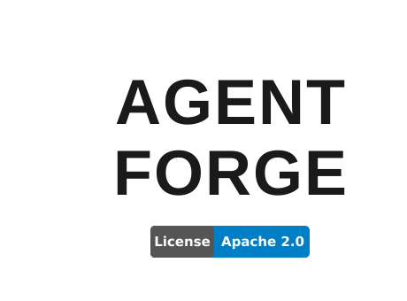
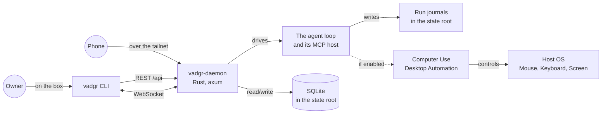

<p align="center">
  
  <picture>
    <source media="(prefers-color-scheme: dark)" srcset="docs/NameLigth.svg">
    <source media="(prefers-color-scheme: light)" srcset="docs/NameDark.svg">
    
  </picture>
</p>

<p align="center">
  
</p>


<p align="center">
  <i><b>An open-source loop that controls your computer, reachable from your phone.</b></i>
</p>

Describe your work in a sentence. Vadgr runs it on your machine - writing code, controlling apps, clicking buttons, and delivering results - while you do something else. You start it from this CLI or from the phone app, and watch it from either. It is not tied to one model vendor: the machine talks to whichever provider you point it at. Cross-platform: Linux, Windows, WSL2 and macOS.

## Platform

<div align="left">

|  | Technology | Status | Role |
|:---:|:---:|:---:|:---|
|  | Linux | Supported | Built, tested and released on every change |
|  | Windows | Supported | Native, with its own installer |
|  | WSL2 | Supported | Desktop automation reaches the Windows side |
|  | macOS | Supported | Grant Accessibility and Screen Recording on first use |

</div>

## Install

Works on **Linux**, **WSL**, **Windows** and **macOS**. Desktop automation is the separate [vadgr-computer-use](https://github.com/MONTBRAIN/vadgr-computer-use) package, which supports all four; on macOS it asks for Accessibility and Screen Recording the first time it runs. The installer sets up everything: git, the Rust toolchain, and the `vadgr` binaries. No Node.js and no browser: the machine's clients are this CLI and the phone app.

```bash
# Linux / macOS / WSL
curl -fsSL https://raw.githubusercontent.com/MONTBRAIN/vadgr/master/install.sh | bash
```

```powershell
# Windows (PowerShell)
irm https://raw.githubusercontent.com/MONTBRAIN/vadgr/master/install.ps1 | iex
```

The daemon owns OpenAI, Gemini and Anthropic connections, their authenticated
model catalogs and the machine default. It calls provider APIs directly and does
not use an agent CLI as a model runtime.

Restart your terminal, then:

```bash
vadgr start
```

### Vadgr CLI

**Services:**

| Command | Description |
|---------|-------------|
| `vadgr start` | Start the vadgr daemon (`vadgr api` is the same command) |
| `vadgr stop` | Stop the daemon |
| `vadgr restart` | Restart the daemon |
| `vadgr status` | Show whether the daemon is running |
| `vadgr logs` | Tail the daemon's log |
| `vadgr update` | Pull the latest code, rebuild and reinstall the binaries |

**Runs:**

| Command | Description |
|---------|-------------|
| `vadgr run "<task>"` | Start a run from a task sentence and watch it |
| `vadgr run "<task>" --background` | Start it and return straight away |
| `vadgr run "<task>" -p <provider> -m <model>` | Run it on a named provider and model |
| `vadgr runs list [--status failed]` | List runs |
| `vadgr runs get <id>` | Show run details |
| `vadgr runs cancel <id>` | Cancel a running run |
| `vadgr runs resume <id>` | Resume a failed run |

`vadgr run` exits `0` when the run completed, `1` when it failed, `2` on a
usage error, `3` when the daemon is not reachable, and `130` on Ctrl-C, which
stops watching and leaves the run going.

**Info:**

| Command | Description |
|---------|-------------|
| `vadgr health` | Check the daemon's health |
| `vadgr providers` | List available providers and models |
| `vadgr computer-use enable` | Enable desktop automation |
| `vadgr computer-use disable` | Disable desktop automation |
| `vadgr computer-use status` | Show computer use and daemon status |

**Providers:**

| Command | Description |
|---------|-------------|
| `vadgr provider login [openai\|gemini\|anthropic]` | Connect or reauthenticate one provider |
| `vadgr provider status [--refresh] [provider]` | Show connections and authenticated catalogs |
| `vadgr provider logout <provider>` | Disconnect a provider that is not the default |
| `vadgr model list` | List models from every connected provider |
| `vadgr model default [provider/model]` | Live-test and set the machine default |

## Architecture



## Modules

### The CLI

`vadgr` starts runs, watches them, pairs the phone and manages the daemon. It
talks to the daemon over HTTP and to a run over a WebSocket, so it is a client
like any other, with no private path in.

### The daemon

One binary. It serves the API the phone and the CLI both call, runs the loop,
owns the MCP host and the cua connection, and writes an append-only journal per
run so a killed machine resumes rather than restarts. Its state lives below the
platform's local-state directory, never below the directory it was started from.

### Desktop Automation

The desktop-automation MCP server lives in its own repository: **[vadgr-computer-use](https://github.com/MONTBRAIN/vadgr-computer-use)**. Install with `pip install vadgr-computer-use`. It gives agents eyes and hands: take a screenshot, reason, click or type, repeat. On WSL2 the package manages its own Windows-side bridge daemon automatically.

## Structure

```
Vadgr/
├── Cargo.toml             # The crate: one daemon, one CLI
├── src/
│   ├── main.rs            # The daemon
│   ├── cli/               # The `vadgr` command
│   ├── config.rs          # Where a machine's state lives, decided in one place
│   ├── migrate.rs         # Bringing older state to that root, before serving
│   ├── routes/            # The HTTP endpoints
│   ├── ws/                # The two run sockets
│   ├── engine/            # The loop, its journal, providers and the MCP host
│   ├── auth/              # Pairing and the two gates
│   ├── db/                # SQLite schema and repositories
│   └── transport/         # Loopback and Tailscale adapters
├── tests/                 # Integration tests
├── E2E/                   # One runbook per release, and its harness
├── install.sh, install.ps1    # The installer
└── scripts/               # The repository's own gates
```

Desktop automation lives in its own repository,
[vadgr-computer-use](https://github.com/MONTBRAIN/vadgr-computer-use), and is
installed as a package when computer use is enabled.

## Contributing

1. Create a branch from `master`:
   ```bash
   git checkout master && git checkout -b feature/your-change
   ```
2. Make your changes and commit:
   ```bash
   git add . && git commit -m "your message"
   ```
3. Push and open a PR into `master`:
   ```bash
   git push -u origin feature/your-change
   ```
