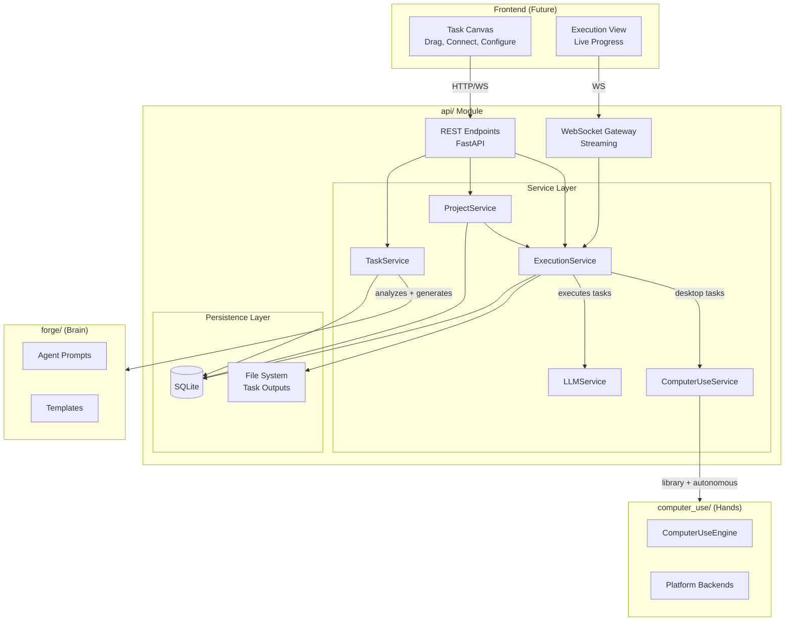
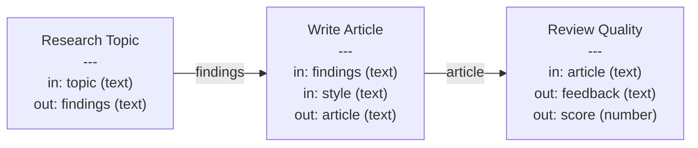
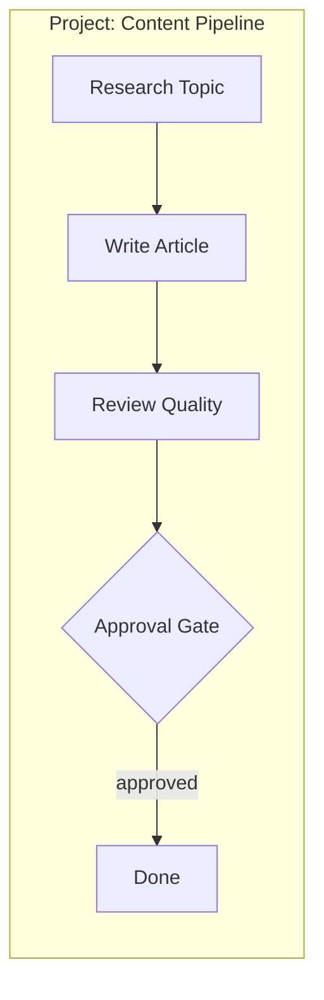
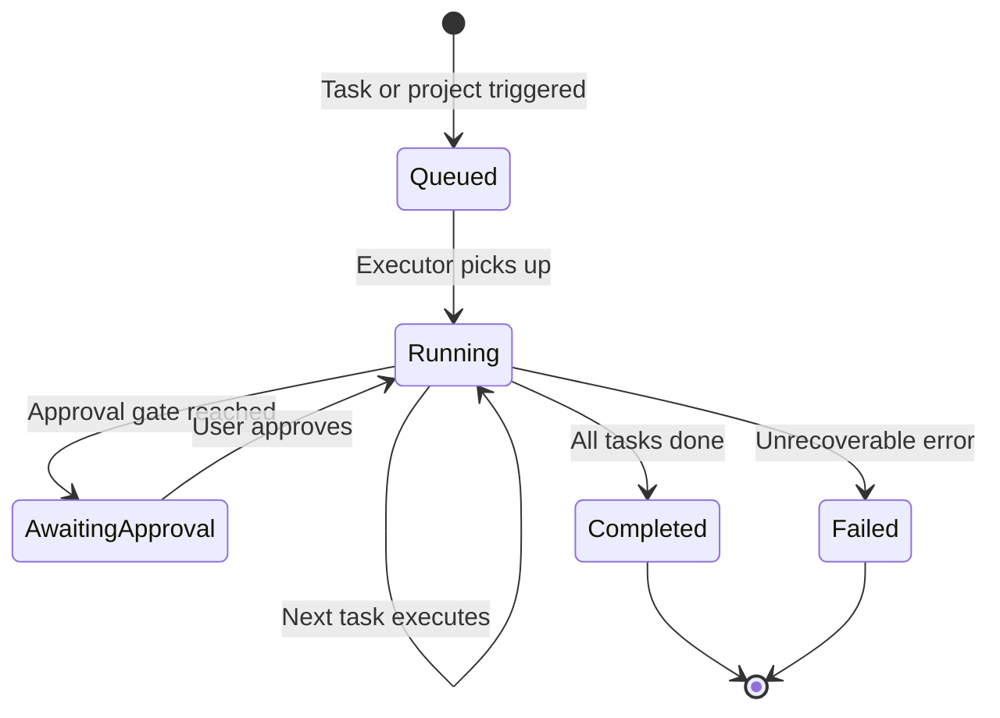
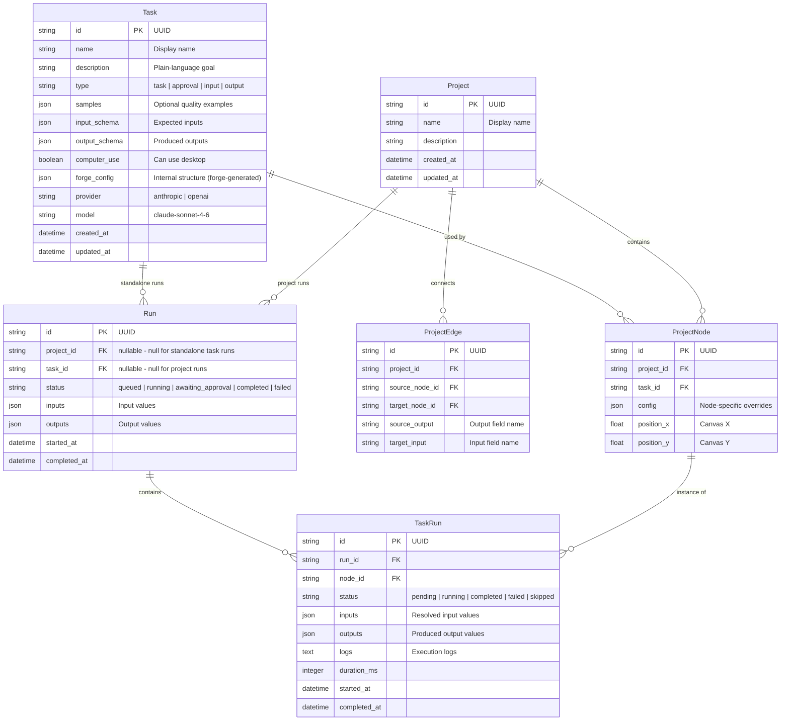
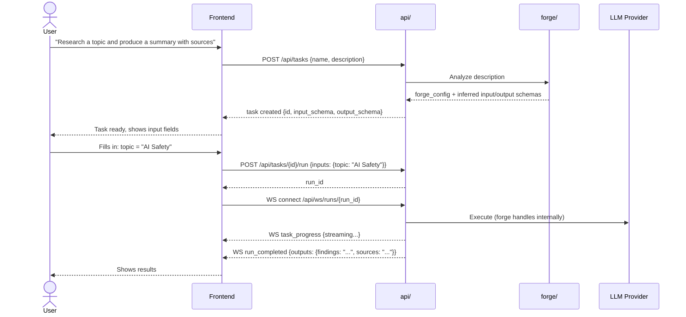
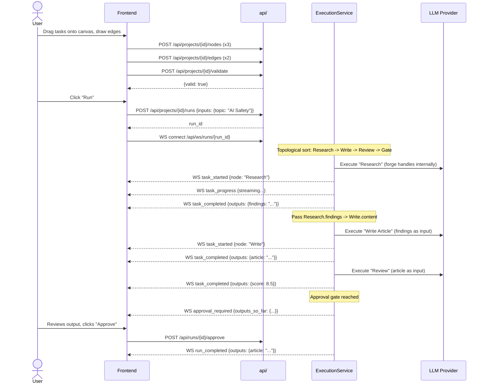
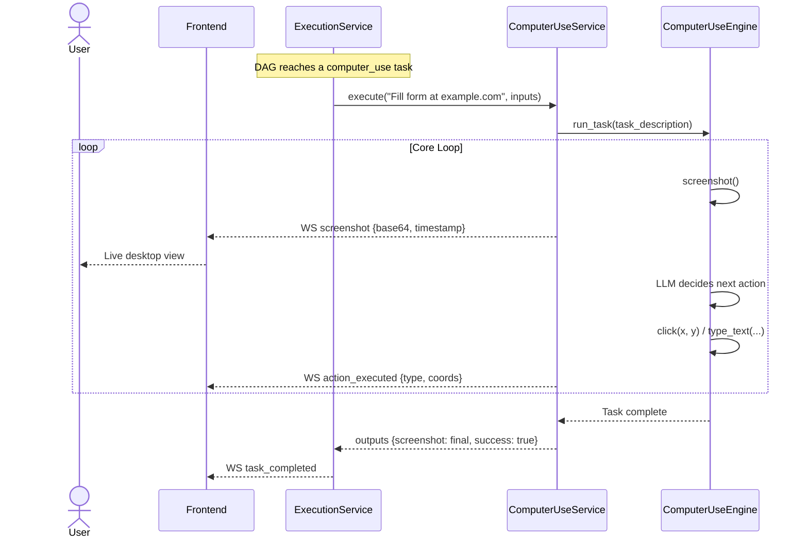

# API Module Architecture

## Vision

Agent Forge becomes a **visual orchestration platform** for AI agents. Users build automation by composing tasks on a canvas, connecting outputs to inputs, and hitting run. No code required.

The platform has two layers:

- **Task** -- the atomic unit. "What I want done." A task can be simple (one LLM call) or complex (a multi-agent workflow with approval gates). The user doesn't care -- they describe the goal, and **forge decides the internal complexity**.
- **Project** -- a DAG (directed acyclic graph) of connected tasks. The output of one task flows as input to the next. Tasks can branch, merge, and run in parallel.

The `api/` module joins `forge/` (the brain) and `computer_use/` (the hands) into a service that a visual frontend can consume.

### Design Principles

1. **The user never thinks about prompts, agents, or LLMs** -- They describe what they want in plain language. Forge analyzes the description and builds whatever is needed internally: a single prompt, multiple agents, approval gates, quality loops. The user sees one box on the canvas.
2. **Module independence preserved** -- `forge/` and `computer_use/` remain standalone. The API imports them; they never import the API.
3. **Definition vs execution** -- A task/project is a reusable template (like a Docker image). A run is one execution of it (like a container). You can run the same project many times with different inputs.
4. **Visual-first** -- Every concept maps to something you can see and drag on a canvas.

---

## MVP Scope

What the MVP delivers:

- Task CRUD (create, configure, delete)
- Project CRUD (canvas with nodes and edges)
- DAG validation (cycle detection, missing inputs)
- Sequential execution of a project (run tasks in topological order)
- Approval gate nodes (pause execution, wait for user)
- Computer use tasks (desktop automation via `computer_use/` engine)
- WebSocket streaming (live progress + screenshot stream during runs)
- SQLite persistence
- Health endpoint

What the MVP does NOT include (future phases):

- Authentication (local use only, `localhost`)
- Parallel task execution
- Loop and conditional nodes
- Task library (pre-built templates)
- Project templates
- Export/import

---

## System Architecture



---

## Core Concepts

### Task (Definition)

A task is a **reusable unit of work**. The user describes what the task should accomplish in plain language -- no technical knowledge required. Forge analyzes the description and decides the internal structure:

- **Simple task** -- single LLM call (e.g., "Summarize this text in 3 bullet points")
- **Complex task** -- multi-step workflow with specialized agents, approval gates, quality loops (e.g., "Research a topic thoroughly and write a paper with citations")

The user never configures prompts, agents, or models. They describe the goal, and forge builds whatever is needed under the hood. Optionally, the user can provide **quality samples** -- examples of what the final output should look like. Forge uses these to understand the expected quality, style, tone, and structure, and bakes that into the generated prompts and quality checks.

Tasks can optionally enable computer use -- when enabled, the task interacts with the desktop (screenshots, clicks, typing) via `computer_use/`.

### Task Input/Output Contract

Every task declares what data it accepts and what it produces. This is how tasks connect on the canvas.



### Project (Definition)

A project is a **DAG of tasks** with edges that define data flow. It's the canvas -- what the user builds visually.



### Run (Execution)

A run is **one execution of a task or project** with specific input values. A standalone task run executes that single task. A project run executes the full DAG. Both use the same run model.



### Node Types (MVP)

| Node Type | Behavior |
|---|---|
| **Task** | User-described unit of work. Can be simple or complex internally -- forge decides. Accepts inputs, produces outputs. |
| **Computer Use Task** | Same as Task, but interacts with the desktop (screenshots, clicks, typing) via `ComputerUseEngine` |
| **Approval Gate** | Pauses execution, shows output, waits for user approve/revise |
| **Input** | Project-level input parameter (starting data) |
| **Output** | Project-level output (final deliverable) |

---

## Data Models



---

## Module Structure

```
api/
    __init__.py
    main.py                         # FastAPI app, lifespan, CORS
    config.py                       # Settings (env vars, defaults)

    models/
        __init__.py
        task.py                     # Task Pydantic models
        project.py                  # Project + nodes + edges models
        run.py                      # Run + task run models
        common.py                   # Pagination, errors, enums

    routes/
        __init__.py
        tasks.py                    # Task CRUD
        projects.py                 # Project CRUD + canvas
        runs.py                     # Run lifecycle + control
        computer_use.py             # Computer use status + direct control
        health.py                   # Health check
        ws.py                       # WebSocket route

    services/
        __init__.py
        task_service.py             # Task CRUD logic
        project_service.py          # Project/DAG validation
        execution_service.py        # Sequential DAG runner
        computer_use_service.py     # ComputerUseEngine wrapper
        llm_service.py              # LLM provider abstraction

    engine/
        __init__.py
        dag.py                      # DAG validation, topological sort
        executor.py                 # Task executor (LLM call or computer use)

    persistence/
        __init__.py
        database.py                 # SQLite connection, migrations
        repositories.py             # Data access layer

    websocket/
        __init__.py
        manager.py                  # Connection manager
        events.py                   # Event types

    docs/
        API_ARCHITECTURE.md         # This document

    tests/
        __init__.py
        conftest.py
        test_tasks.py
        test_projects.py
        test_runs.py
        test_dag.py
        test_executor.py
        test_database.py
        test_services.py
        test_websocket.py
        test_health.py

    Agent_Forge_API.postman_collection.json
    requirements.txt
```

---

## API Endpoints

### Tasks (`/api/tasks`)

| Method | Path | Description |
|---|---|---|
| `POST` | `/api/tasks` | Create a new task |
| `GET` | `/api/tasks` | List all tasks |
| `GET` | `/api/tasks/{id}` | Get task by ID |
| `PUT` | `/api/tasks/{id}` | Update task |
| `DELETE` | `/api/tasks/{id}` | Delete task |
| `POST` | `/api/tasks/{id}/run` | Run a task directly (no project needed) |
| `GET` | `/api/tasks/{id}/runs` | List runs of this task |

#### Create Task

The user describes what the task should do. Forge handles the rest.

```json
{
  "name": "Research Topic",
  "description": "Research a given topic using multiple sources. Produce a structured summary with key findings, supporting evidence, and a list of sources.",
  "samples": [
    "## Quantum Computing in Healthcare\n\n### Key Findings\n1. Drug discovery acceleration: 40% reduction in molecular simulation time...\n\n### Sources\n- Nature, 2025: \"Quantum advantage in protein folding\"..."
  ]
}
```

`samples` is optional. When provided, forge uses them to calibrate the internal prompts -- matching the tone, structure, depth, and quality bar the user expects.

The API sends the description to forge. Forge analyzes complexity, generates the internal structure (prompts, agents, steps), and infers input/output schemas. The response includes everything:

```json
{
  "id": "uuid",
  "name": "Research Topic",
  "description": "Research a given topic using multiple sources...",
  "type": "task",
  "input_schema": [
    { "name": "topic", "type": "text", "required": true }
  ],
  "output_schema": [
    { "name": "findings", "type": "text" },
    { "name": "sources", "type": "text" }
  ],
  "computer_use": false,
  "forge_config": {
    "complexity": "simple",
    "agents": 1,
    "steps": 1
  },
  "provider": "anthropic",
  "model": "claude-sonnet-4-6"
}
```

The user can tweak the inferred schemas if needed, but never touches prompts or agent configs. For a complex description, forge might return:

```json
{
  "forge_config": {
    "complexity": "multi_step",
    "agents": 3,
    "steps": 5,
    "has_quality_loop": true
  }
}
```

Same single node on the canvas either way.

#### Run Task Directly

No project needed. Just provide inputs and run.

```json
POST /api/tasks/{id}/run

{
  "inputs": {
    "topic": "Quantum computing in drug discovery"
  }
}
```

Response:

```json
{
  "run_id": "uuid",
  "status": "queued"
}
```

Connect via WebSocket at `/api/ws/runs/{run_id}` for live progress.

### Projects (`/api/projects`)

| Method | Path | Description |
|---|---|---|
| `POST` | `/api/projects` | Create a new project |
| `GET` | `/api/projects` | List projects |
| `GET` | `/api/projects/{id}` | Get project with full graph |
| `PUT` | `/api/projects/{id}` | Update project metadata |
| `DELETE` | `/api/projects/{id}` | Delete project |
| `POST` | `/api/projects/{id}/nodes` | Add a node to the canvas |
| `PUT` | `/api/projects/{id}/nodes/{node_id}` | Update node (position, config) |
| `DELETE` | `/api/projects/{id}/nodes/{node_id}` | Remove node |
| `POST` | `/api/projects/{id}/edges` | Connect two nodes |
| `DELETE` | `/api/projects/{id}/edges/{edge_id}` | Disconnect two nodes |
| `POST` | `/api/projects/{id}/validate` | Validate DAG |
| `PUT` | `/api/projects/{id}/canvas` | Bulk save canvas state (planned) |

#### Connect Nodes

```json
{
  "source_node_id": "uuid-node-research",
  "target_node_id": "uuid-node-write",
  "source_output": "findings",
  "target_input": "content"
}
```

#### Validate Response

```json
{
  "valid": false,
  "errors": [
    {
      "type": "cycle_detected",
      "message": "Cycle found: node-A -> node-B -> node-A"
    },
    {
      "type": "missing_input",
      "node_id": "uuid-node-write",
      "message": "Required input 'style' has no incoming connection and no default"
    }
  ]
}
```

### Runs (`/api/runs`)

| Method | Path | Description |
|---|---|---|
| `POST` | `/api/projects/{id}/runs` | Start a new run |
| `GET` | `/api/runs` | List runs (filterable by project, status) |
| `GET` | `/api/runs/{id}` | Get run with all task statuses |
| `POST` | `/api/runs/{id}/cancel` | Cancel a run |
| `POST` | `/api/runs/{id}/approve` | Approve at an approval gate |
| `POST` | `/api/runs/{id}/revise` | Request revision at a gate (planned) |
| `GET` | `/api/runs/{id}/tasks/{task_run_id}` | Get task run details + logs (planned) |

Runs can originate from either `POST /api/tasks/{id}/run` (standalone) or `POST /api/projects/{id}/runs` (project DAG). The run model is the same -- standalone runs just have `task_id` set instead of `project_id`.

#### Start Run

```json
{
  "inputs": {
    "topic": "Quantum computing applications in drug discovery"
  }
}
```

### Computer Use (`/api/computer-use`)

| Method | Path | Description |
|---|---|---|
| `GET` | `/api/computer-use/status` | Platform info, availability |
| `POST` | `/api/computer-use/screenshot` | Capture current screen (planned) |

### Health (`/api/health`)

| Method | Path | Description |
|---|---|---|
| `GET` | `/api/health` | Server health + module availability |

```json
{
  "status": "healthy",
  "modules": {
    "forge": true,
    "computer_use": true
  },
  "platform": "wsl2",
  "version": "0.1.0"
}
```

### WebSocket

| Path | Description |
|---|---|
| `/api/ws/runs/{id}` | Live execution progress for a run |

---

## WebSocket Protocol

All messages use a consistent envelope:

```json
{
  "type": "event_type",
  "data": {},
  "timestamp": "2026-03-06T10:30:00Z"
}
```

### Event Types (MVP)

| Type | Direction | Description |
|---|---|---|
| `run_started` | Server -> Client | Run began |
| `task_started` | Server -> Client | A task began executing |
| `task_progress` | Server -> Client | Streaming tokens from LLM |
| `task_completed` | Server -> Client | A task finished (includes outputs) |
| `task_failed` | Server -> Client | A task failed |
| `approval_required` | Server -> Client | Approval gate reached |
| `approval_response` | Client -> Server | User approves or revises |
| `screenshot` | Server -> Client | Screenshot from computer use task (base64) |
| `action_executed` | Server -> Client | Computer use action performed (click, type, etc.) |
| `run_completed` | Server -> Client | All tasks done |
| `run_failed` | Server -> Client | Run failed |

---

## Key Flows

### Flow 1: Create and Run a Task (Standalone)

User creates a task by describing the goal, then runs it directly -- no project needed.



### Flow 2: Build and Run a Project



### Flow 3: Computer Use Task in a Project

A project where one task automates the desktop with live screenshot streaming.



---

## DAG Engine

### `engine/dag.py`

```python
class DAG:
    """Validated directed acyclic graph of project nodes."""

    def __init__(self, nodes: list[ProjectNode], edges: list[ProjectEdge])

    def validate(self) -> list[ValidationError]:
        """Check for cycles, missing required inputs, type mismatches."""

    def topological_sort(self) -> list[ProjectNode]:
        """Return nodes in execution order (sequential for MVP)."""

    def resolve_inputs(self, node: ProjectNode, outputs: dict[str, Any]) -> dict:
        """Follow edges backward to collect input values from upstream outputs."""
```

### `engine/executor.py`

```python
class TaskExecutor:
    """Executes a single task node."""

    async def execute(
        self,
        task: Task,
        inputs: dict,
        callback: EventCallback,
    ) -> dict:
        """Run a task and return its outputs.

        Uses forge_config to determine execution strategy:
        - Simple: single LLM call with forge-generated prompt.
        - Multi-step: runs the forge-generated internal workflow
          (multiple agents, quality loops, etc.).
        - Computer use: delegates to ComputerUseService.run_task().
        """
```

### Execution Flow (Sequential MVP)

```python
# Simplified execution loop
sorted_nodes = dag.topological_sort()
outputs = {}  # node_id -> {field: value}

for node in sorted_nodes:
    if node.task.type == "approval":
        emit("approval_required", outputs_so_far=outputs)
        await wait_for_approval()
        continue

    if node.task.type == "input":
        outputs[node.id] = run.inputs
        continue

    resolved = dag.resolve_inputs(node, outputs)
    if node.task.computer_use:
        result = await computer_use_service.run_task(node.task, resolved, callback)
    else:
        result = await executor.execute(node.task, resolved, callback)
    outputs[node.id] = result
```

---

## Persistence

### SQLite Schema

```sql
CREATE TABLE tasks (
    id TEXT PRIMARY KEY,
    name TEXT NOT NULL,
    description TEXT NOT NULL DEFAULT '',
    type TEXT NOT NULL DEFAULT 'task',
    samples TEXT DEFAULT '[]',
    input_schema TEXT DEFAULT '[]',
    output_schema TEXT DEFAULT '[]',
    computer_use INTEGER DEFAULT 0,
    forge_config TEXT DEFAULT '{}',
    provider TEXT NOT NULL DEFAULT 'anthropic',
    model TEXT NOT NULL DEFAULT 'claude-sonnet-4-6',
    created_at TEXT NOT NULL,
    updated_at TEXT NOT NULL
);

CREATE TABLE projects (
    id TEXT PRIMARY KEY,
    name TEXT NOT NULL,
    description TEXT DEFAULT '',
    created_at TEXT NOT NULL,
    updated_at TEXT NOT NULL
);

CREATE TABLE project_nodes (
    id TEXT PRIMARY KEY,
    project_id TEXT NOT NULL REFERENCES projects(id) ON DELETE CASCADE,
    task_id TEXT NOT NULL REFERENCES tasks(id) ON DELETE CASCADE,
    config TEXT DEFAULT '{}',
    position_x REAL DEFAULT 0,
    position_y REAL DEFAULT 0
);

CREATE INDEX idx_nodes_project ON project_nodes(project_id);

CREATE TABLE project_edges (
    id TEXT PRIMARY KEY,
    project_id TEXT NOT NULL REFERENCES projects(id) ON DELETE CASCADE,
    source_node_id TEXT NOT NULL REFERENCES project_nodes(id) ON DELETE CASCADE,
    target_node_id TEXT NOT NULL REFERENCES project_nodes(id) ON DELETE CASCADE,
    source_output TEXT NOT NULL,
    target_input TEXT NOT NULL
);

CREATE INDEX idx_edges_project ON project_edges(project_id);

CREATE TABLE runs (
    id TEXT PRIMARY KEY,
    project_id TEXT REFERENCES projects(id),
    task_id TEXT REFERENCES tasks(id) ON DELETE SET NULL,
    status TEXT NOT NULL DEFAULT 'queued',
    inputs TEXT DEFAULT '{}',
    outputs TEXT DEFAULT '{}',
    started_at TEXT,
    completed_at TEXT
);

CREATE INDEX idx_runs_project ON runs(project_id);

CREATE TABLE task_runs (
    id TEXT PRIMARY KEY,
    run_id TEXT NOT NULL REFERENCES runs(id) ON DELETE CASCADE,
    node_id TEXT NOT NULL REFERENCES project_nodes(id),
    status TEXT NOT NULL DEFAULT 'pending',
    inputs TEXT DEFAULT '{}',
    outputs TEXT DEFAULT '{}',
    logs TEXT DEFAULT '',
    duration_ms INTEGER DEFAULT 0,
    started_at TEXT,
    completed_at TEXT
);

CREATE INDEX idx_task_runs_run ON task_runs(run_id);
```

---

## Configuration

```yaml
# api/config.yaml
server:
  host: "127.0.0.1"
  port: 8000
  cors_origins: ["http://localhost:3000"]

database:
  path: "data/agent_forge.db"

computer_use:
  enabled: true
  config_path: "computer_use/config.yaml"

providers:
  anthropic:
    api_key: "${ANTHROPIC_API_KEY}"
    default_model: "claude-sonnet-4-6"
  openai:
    api_key: "${OPENAI_API_KEY}"
    default_model: "gpt-4o"
```

---

## Error Handling

```json
{
  "error": {
    "code": "TASK_NOT_FOUND",
    "message": "Task with id 'abc-123' not found",
    "details": {}
  }
}
```

| HTTP Status | Error Code | When |
|---|---|---|
| 400 | `INVALID_REQUEST` | Malformed request body |
| 400 | `INVALID_DAG` | Project has cycles or type mismatches |
| 404 | `TASK_NOT_FOUND` | Task ID does not exist |
| 404 | `PROJECT_NOT_FOUND` | Project ID does not exist |
| 404 | `RUN_NOT_FOUND` | Run ID does not exist |
| 409 | `RUN_NOT_ACTIVE` | Action on completed/cancelled run |
| 409 | `NO_GATE_PENDING` | Approving when no gate is waiting |
| 422 | `COMPUTER_USE_UNAVAILABLE` | Computer use requested but not available |
| 422 | `PROVIDER_NOT_CONFIGURED` | LLM provider not set up |
| 422 | `MISSING_INPUTS` | Run started without required inputs |
| 500 | `INTERNAL_ERROR` | Unexpected server error |

---

## Testing Strategy

```
api/tests/
    conftest.py              # TestClient, in-memory SQLite, mocked LLM
    test_tasks.py            # Task CRUD
    test_projects.py         # Project CRUD, node/edge management
    test_dag.py              # Cycle detection, topological sort, input resolution
    test_executor.py         # Task execution with mocked LLM
    test_runs.py             # Run lifecycle, approval gates
    test_database.py         # Database connection and schema
    test_services.py         # Service layer unit tests
    test_websocket.py        # WS events
    test_health.py           # Health endpoint
```

- All LLM calls mocked
- `ComputerUseEngine` mocked (no real desktop access)
- In-memory SQLite for integration tests
- DAG tests are pure logic
- Target: 80%+ coverage

---

## Future Phases

Once the MVP is solid, these are added incrementally:

| Phase | Feature | Description |
|---|---|---|
| 2 | **Parallel execution** | Tasks without dependencies run concurrently via `asyncio.gather` |
| 2 | **Loop nodes** | Repeat a task until a condition is met |
| 2 | **Conditional nodes** | Route data based on conditions |
| 3 | **Task library** | Pre-built reusable task templates |
| 3 | **Project templates** | Starter projects (research pipeline, content pipeline) |
| 4 | **Authentication** | API key auth for remote access |
| 4 | **Visual frontend** | React + React Flow canvas, live execution view |
